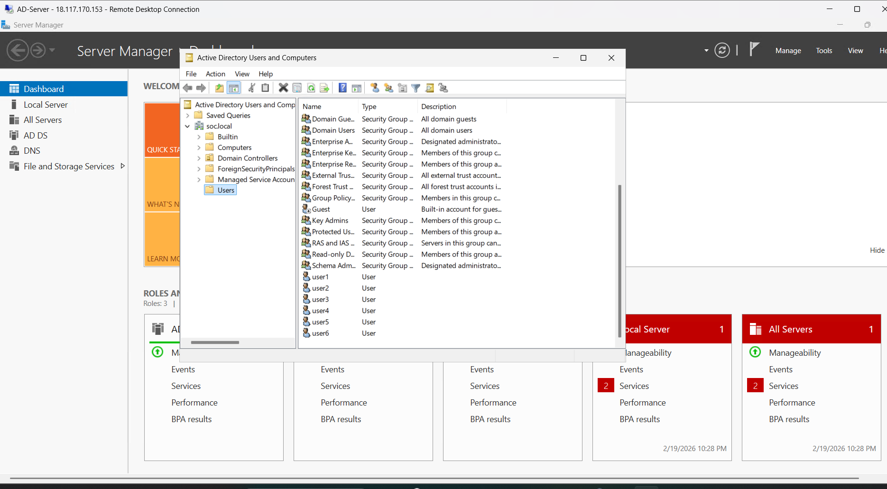

# 🔐 SOC Lab Build – Day 3  
## Active Directory + Security Auditing (Enterprise SOC Lab - AWS)

---

# 📘 Introduction

In this lab, we built a small enterprise environment inside AWS.

We:

- Created a Windows Server (Domain Controller)
- Installed Active Directory
- Created domain users
- Enabled advanced security auditing
- Connected logs to Splunk SIEM

The goal is to simulate a real company network and practice SOC monitoring.

---

# 🏗 1️⃣ Architecture Overview
<p align="center">
  
</p>

This is how the lab environment works:

Attacker → Internet → AWS VPC → Active Directory → Splunk → SOC Analyst

## 📸 Architecture Diagram (From Page 3)


> The diagram shows:
> - Attacker sending traffic
> - AWS VPC hosting the server
> - Active Directory Domain Controller
> - Logs sent to Splunk
> - SOC Analyst monitoring everything

---

# 🖥 2️⃣ Deploy Windows Server (Domain Controller)

### Steps:

1. Go to AWS EC2
2. Launch Windows Server instance
3. Place it inside custom VPC
4. Allow:
   - RDP (3389)
   - Splunk (9997, 8000)
5. Connect using Remote Desktop

This server will become our Domain Controller.

<p align="center">
  
</p>
---

# 🧠 3️⃣ Install Active Directory (AD DS)

Active Directory manages users and permissions.

### Steps:

1. Open **Server Manager**
2. Click **Add Roles and Features**
3. Select:
   - Active Directory Domain Services (AD DS)
4. Install the role
5. Promote server to Domain Controller
6. Create new domain:

```
soc.local
```

7. Restart server

---

# 👥 4️⃣ Create Domain Users

After AD installation, create users.

### Steps:

1. Open:
   Active Directory Users and Computers
2. Right-click → New → User
3. Create test users
4. Assign:
   - Normal users
   - Domain Admin (if required)

## 📸 Active Directory Users Window 

<p align="center">
  
</p>

> This screenshot shows:
> - Domain structure
> - Users list
> - Security groups
> - Domain Admins group

---

# 🔐 5️⃣ Configure Advanced Audit Policies

To monitor security events, enable auditing.

### Enabled Events:

- ✅ Logon Success (Event ID 4624)
- ✅ Logon Failure (Event ID 4625)
- ✅ Account Lockout (4740)
- ✅ User & Group Management
- ✅ Credential Validation
- ✅ Process Creation (4688)
- ✅ Privilege Escalation Monitoring

These logs help detect:

- Brute force attacks
- Privilege abuse
- Suspicious processes
- Lateral movement

---

# 📦 6️⃣ Install Splunk Universal Forwarder

Now we send logs to SIEM.

### Steps:

1. Download Splunk Universal Forwarder
2. Install on:
   - Domain Controller
3. Configure forwarding to:

```
Splunk Server IP
Port: 9997
```

4. Start Splunk service

---

# 🌐 7️⃣ Enable Splunk Web Access

Open browser:

```
http://<splunk-server-ip>:8000
```

Login as admin.

---

# 🔍 8️⃣ View Logs in Splunk

Go to:

Search & Reporting → New Search

Search example:

```
index=wineventlog
```

You will see Windows Security Events.

## 📸 Splunk Log Search (From Page 4)

<p align="center">
  
</p>

> This screenshot shows:
> - Event logs
> - EventCode values
> - Login events
> - Security event timeline

---

# 🎯 Lab Objective

This lab helps practice:

- Windows Security Log Analysis
- Active Directory Monitoring
- Privilege Escalation Detection
- Brute-force Detection
- SOC Alert Creation
- Log Correlation

---

# 🚀 Next Steps

Next we will:

1. Deploy Windows Endpoint
2. Join endpoint to domain
3. Install Splunk Forwarder
4. Simulate attacks:
   - Brute Force
   - Lateral Movement
   - Privilege Escalation
5. Create detection rules & dashboards

---

# 🏆 Final Outcome

We built a real Enterprise SOC Lab including:

- Active Directory Environment
- Centralized Logging (SIEM)
- Security Monitoring
- Attack Simulation Capability


---

# 📚 Reference

Based on:
SOC Lab Build – Day 3 | Active Directory + Security Auditing :contentReference[oaicite:1]{index=1}
