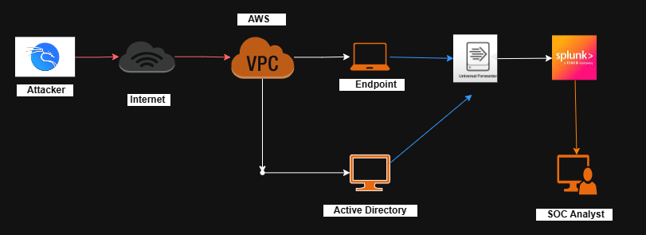
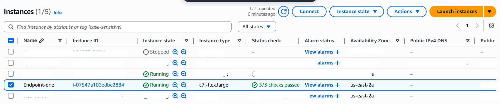
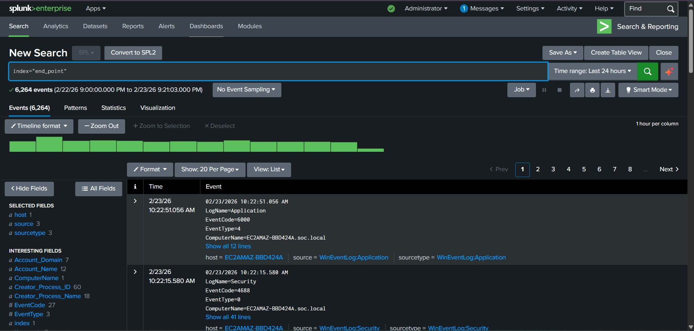

# 📝 DAY 4 – Endpoint Deployment & Log Forwarding to Splunk


---

# 🧠 What Are We Building?

Imagine this like a story:

👨‍💻 Attacker → 🌐 Internet → ☁ AWS → 🖥 Windows Computer → 📦 Splunk → 🧑‍💼 SOC Analyst

We are building a small company network in AWS.
Then we send all computer logs to Splunk so we can monitor everything.

---

# 🖼 Lab Architecture
<p align="center">
  
</p>

This shows:

- Attacker outside
- AWS VPC
- Windows Endpoint
- Active Directory
- Splunk Server
- SOC Analyst

---

# 🛠 PART 1 – Create Windows Endpoint in AWS

---

## ✅ Step 1 – Login to AWS

1. Open AWS Console
2. Click **EC2**
3. Click **Launch Instance**

---

## ✅ Step 2 – Configure Instance

Choose:

- OS: Windows 10 / Windows Server
- Network: Your SOC VPC
- Subnet: Private Subnet
- Security Group: Allow RDP (3389)

Click **Launch**

---

## EC2 Instance Running


<p align="center">
  
</p>


If you see **Running** → Good job 🎉

---

## ✅ Step 3 – Connect to Windows

1. Select the instance
2. Click **Connect**
3. Download RDP file
4. Login as Administrator

Now you are inside your Windows endpoint.

---

# 🏢 PART 2 – Join the Computer to Domain (soc.local)

This makes the computer part of your company network.

---

## ✅ Step 1 – Open System Settings

Press:

```
Win + R
```

Type:

```
sysdm.cpl
```

Click **Change**

Select:

```
Domain → soc.local
```

Enter domain admin username and password.

Restart computer.

Now your computer belongs to the company network 🏢

---

# 📦 PART 3 – Install Splunk Universal Forwarder

This is the log sender 📤

---

## ✅ Step 1 – Download Forwarder

On Windows endpoint:

1. Open browser
2. Go to Splunk website
3. Download:
   **Splunk Universal Forwarder (Windows)**

---

## ✅ Step 2 – Install

During installation:

✔ Accept license  
✔ Enter Splunk Server IP  
✔ Port: `9997`  
✔ Finish  

Now forwarder is installed.

---

# ⚙ PART 4 – Enable Log Monitoring

---

## ✅ Step 1 – Open Command Prompt (Admin)

Go to Splunk folder:

```cmd
cd "C:\Program Files\SplunkUniversalForwarder\bin"
```

Enable Security Logs:

```cmd
splunk add monitor WinEventLog:Security
```

Enable System Logs:

```cmd
splunk add monitor WinEventLog:System
```

Enable Application Logs:

```cmd
splunk add monitor WinEventLog:Application
```

Restart Splunk:

```cmd
splunk restart
```

Now logs are being sent to Splunk 📡

---

# 🔍 PART 5 – Verify Logs in Splunk

Go to Splunk Web.

Search:

```spl
index="end_point"
```

---

## Splunk Receiving Logs
<p align="center">
  
</p>


If you see events like:

- EventCode=4624
- EventCode=4625
- EventCode=4688
- EventCode=7045

🔥 SUCCESS! Logs are working!

---

# 🛡 What Can You Detect Now?

You can now detect:

| Attack | Event ID |
|--------|----------|
| Successful Login | 4624 |
| Failed Login | 4625 |
| Process Creation | 4688 |
| Service Creation | 7045 |
| User Added to Admin | 4732 |

Your SOC can now see everything happening on the endpoint 👀

---

# 🎯 Why This Is Important

In real companies:

- Endpoints are main attack targets
- Hackers try password attacks
- Hackers run malware
- Hackers escalate privileges

By sending logs to Splunk, you can:

✔ Monitor everything  
✔ Detect attacks  
✔ Investigate incidents  
✔ Build SOC skills  

Hands-on practice > Only theory.

---

# 🚀 What You Built Today

✔ Windows EC2 inside AWS  
✔ Joined to Active Directory  
✔ Installed Splunk Forwarder  
✔ Sent logs to Splunk  
✔ Enabled enterprise-level monitoring  

This is real SOC work.

---

# 🏁 Final Test

If this works:

```spl
index=*
```

And you see Windows logs →  

🎉 Your Endpoint Deployment & Log Forwarding is SUCCESSFUL.

---

# 📌 END OF DAY 4 – Endpoint Deployment & Log Forwarding
