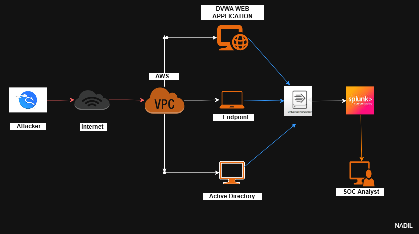
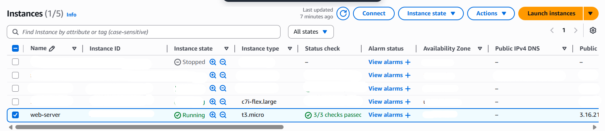
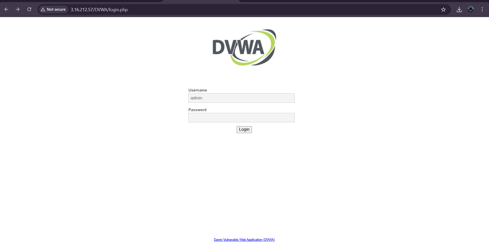
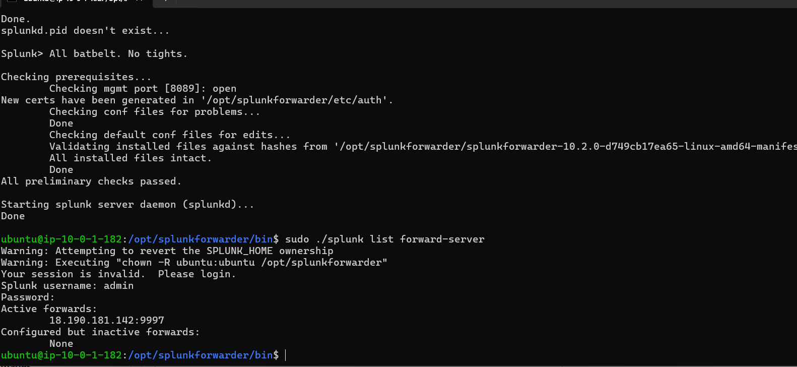
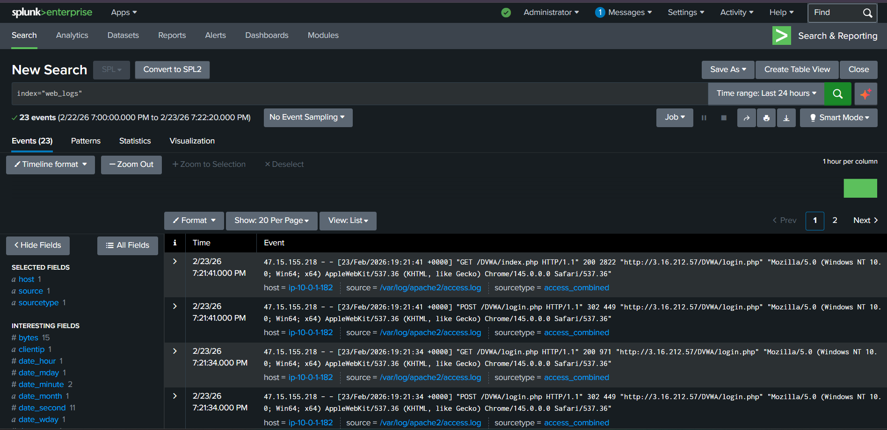

# Web Server Log Monitoring with Splunk | SOC Lab

This project demonstrates how to deploy a vulnerable web application in AWS and monitor its logs using **Splunk SIEM**.
The goal is to simulate real-world attacks and detect them using centralized log monitoring.

This lab is part of my **SOC Analyst learning journey**, focusing on **log ingestion, detection engineering, and security monitoring**.

---

# 🏗 SOC Lab Architecture

The architecture consists of a simulated attacker accessing a vulnerable web server hosted in AWS. Logs from the web server are forwarded to Splunk for analysis.

<div align="center">



<b>SOC Lab Architecture</b>

</div>
### Components

* **Attacker Machine** – Simulates malicious activity
* **Internet** – External access layer
* **AWS VPC** – Cloud network environment
* **Web Server (Apache + DVWA)** – Vulnerable application
* **Splunk Universal Forwarder** – Sends logs to SIEM
* **Splunk Enterprise** – Centralized log analysis
* **SOC Analyst** – Monitors and investigates alerts

---

# ⚙️ Step 1 — Launch AWS EC2 Instance

1. Go to **AWS Console**
2. Navigate to **EC2 → Launch Instance**

Configuration:

* OS: **Ubuntu 22.04**
* Instance Type: **t3.micro**
* Security Group:

  * Allow **HTTP (80)**
  * Allow **SSH (22)**
  * Allow **Splunk Forwarding (9997)**

After launching, connect using SSH.

```
ssh ubuntu@<public-ip>
```

Example EC2 Instance:

<div align="center">




</div>

---

# ⚙️ Step 2 — Install Apache Web Server

Update system packages.

```bash
sudo apt update
sudo apt install apache2 -y
```

Start Apache.

```bash
sudo systemctl start apache2
sudo systemctl enable apache2
```

Verify Apache is running.

```
http://<public-ip>
```

---

# ⚙️ Step 3 — Install PHP and MySQL

DVWA requires PHP and a database.

```bash
sudo apt install php php-mysqli php-gd libapache2-mod-php mysql-server git -y
```

Restart Apache.

```bash
sudo systemctl restart apache2
```

---

# ⚙️ Step 4 — Install DVWA (Damn Vulnerable Web Application)

Navigate to web root.

```bash
cd /var/www/html
```

Clone DVWA repository.

```bash
sudo git clone https://github.com/digininja/DVWA.git
```

Set permissions.

```bash
sudo chown -R www-data:www-data DVWA
```

Create database.

```bash
sudo mysql
```

Inside MySQL:

```sql
create database dvwa;
exit;
```

Access DVWA in browser.

```
http://<public-ip>/DVWA/login.php
```

Example DVWA login page:

<div align="center">




</div>

Default credentials:

```
Username: admin
Password: password
```

---

# ⚙️ Step 5 — Install Splunk Universal Forwarder

Download Splunk Forwarder.

```bash
wget -O splunkforwarder.tgz https://download.splunk.com/products/universalforwarder/releases/10.2.0/linux/splunkforwarder-10.2.0-linux-amd64.tgz
```

Extract.

```bash
tar -xvzf splunkforwarder.tgz
```

Move to `/opt`.

```bash
sudo mv splunkforwarder /opt/
```

Start Splunk Forwarder.

```bash
cd /opt/splunkforwarder/bin
sudo ./splunk start --accept-license
```

Enable boot start.

```bash
sudo ./splunk enable boot-start
```

---

# ⚙️ Step 6 — Connect Forwarder to Splunk Server

Configure Splunk indexer connection.

```bash
sudo ./splunk add forward-server <splunk-server-ip>:9997
```

Verify connection.

```bash
sudo ./splunk list forward-server
```

Example output:

<div align="center">




</div>

---

# ⚙️ Step 7 — Forward Apache Logs

Add Apache access log.

```bash
sudo ./splunk add monitor /var/log/apache2/access.log -index web_logs -sourcetype access_combined
```

Add Apache error log.

```bash
sudo ./splunk add monitor /var/log/apache2/error.log -index web_logs
```

Restart forwarder.

```bash
sudo ./splunk restart
```

---

# ⚙️ Step 8 — Verify Logs in Splunk

Login to **Splunk Enterprise Web UI**.

```
http://<splunk-server-ip>:8000
```

Run search query.

```
index=web_logs
```

Example Apache logs in Splunk:

<div align="center">




</div>
Logs include:

* Client IP
* HTTP method
* Request URI
* Response code
* User agent

---

# 📂 Logs Ingested

```
/var/log/apache2/access.log
/var/log/apache2/error.log
```

Index configuration:

```
Index: web_logs
Sourcetype: access_combined
```

---

# 🛠 Key Skills Demonstrated

* AWS EC2 Deployment
* Apache Web Server Configuration
* DVWA Vulnerable Application Setup
* Splunk Universal Forwarder Installation
* Log Forwarding Configuration
* SIEM Log Analysis
* Security Monitoring

---

# 🔎 Sample Splunk Query

Find all HTTP requests.

```
index=web_logs
```

Find login attempts.

```
index=web_logs "login.php"
```

Find suspicious requests.

```
index=web_logs status=404
```

---

# 🎯 Next Steps

Planned attack simulations:

* SQL Injection
* Brute Force Attack
* Cross-Site Scripting (XSS)
* Command Injection

Future improvements:

* Splunk dashboards
* Security alerts
* Detection engineering

---

# 📚 Learning Outcome

This project helped me understand:

* How logs are generated by web servers
* How logs are forwarded securely to a SIEM
* How SOC analysts monitor and investigate activity
* How attack simulation helps improve detection rules

---

# 👨‍💻 Author

**Nadhil**

SOC Analyst | Cybersecurity Enthusiast

---

# ⭐ If you found this project useful

Give the repository a **star** ⭐
