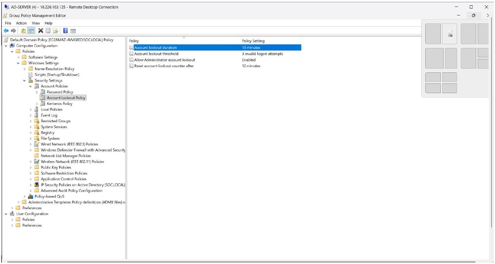
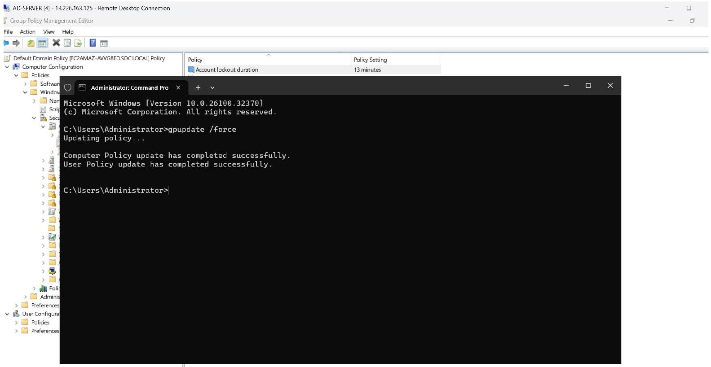
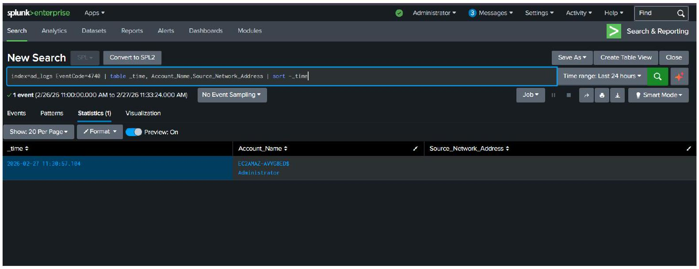

# AD-02 — Account Lockout Simulation & Detection (Event ID 4740)


---

## 📋 Executive Summary

An account lockout scenario was simulated against an Active Directory user account by performing repeated failed login attempts via RDP. After exceeding the configured lockout threshold (3 invalid attempts), Windows enforced the Account Lockout Policy and generated Event ID 4740 (Account Lockout) alongside Event ID 4625 (Failed Logon) entries. Splunk SIEM successfully detected both the failed logon cluster and the resulting lockout event, correlating the source IP, targeted account, and timeline. This lab validates that the Account Lockout Policy is correctly configured and that the SIEM detection pipeline is operational for brute force containment scenarios.

---

## 🧩 Lab Environment

| Component | Details |
|---|---|
| Attacker Machine | Analyst Laptop |
| Target Server | Active Directory Domain Controller (AWS EC2) |
| Protocol | RDP (Remote Desktop Protocol) — Port 3389 |
| SIEM | Splunk (index = windows) |
| Log Source | Windows Security Event Log |
| Policy Configured | Account Lockout Policy via Group Policy (GPO) |

---

## 🎯 Objectives

- Configure Account Lockout Policy via Group Policy Management
- Simulate a brute force credential attack to exceed the lockout threshold
- Trigger and capture Event ID 4740 (Account Lockout) in Windows Security logs
- Detect and investigate the lockout event using Splunk SPL queries
- Correlate Event ID 4625 (Failed Logon) with Event ID 4740 (Account Lockout)
- Perform a full SOC analyst investigation workflow

---

## 🔴 Attack Simulation

### Phase 1 — Configure Account Lockout Policy (Defense Setup)

Group Policy was configured on the Active Directory Domain Controller to enforce account lockout after repeated failed attempts.

**Navigation Path:**

```
Computer Configuration
→ Policies
→ Windows Settings
→ Security Settings
→ Account Policies
→ Account Lockout Policy
```

**Policy Values Set:**

```
Account lockout threshold  : 3 invalid logon attempts
Account lockout duration   : 15 minutes
Observation window         : 15 minutes
```

After configuring the policy, it was applied immediately using:

```cmd
gpupdate /force
```

** Account Lockout Policy Configuration:**

<p align="center">
  
</p>


<p align="center">
  
</p>
---

### Phase 2 — Generate Failed Login Attempts (Trigger Lockout)

From the attacker machine, RDP was opened and connection was attempted to the AD server. Wrong passwords were entered repeatedly against a domain user account until lockout was triggered.

```
Target     : Active Directory Domain Controller
Username   : [domain user]
Password   : [incorrect — repeated]
Attempts   : 4 (threshold = 3 → lockout on 4th attempt)
```

Each failed attempt generates the following in Windows Security logs:

```
Event ID  : 4625
Log Source: Security
Category  : Logon
Reason    : Bad Password / Unknown Username
```

Upon exceeding the threshold, Windows locks the account and generates:

```
Event ID  : 4740
Log Source: Security
Category  : Account Management
Message   : A user account was locked out
```


---

### Phase 3 — Verify Lockout in Active Directory Users and Computers

After triggering the lockout, the account status was confirmed in ADUC (Active Directory Users and Computers):

```
dsa.msc → Find user → Account tab → "Unlock account" checkbox visible
```

This confirms the domain controller registered the lockout and is enforcing it.

---

## 🔍 Indicators of Compromise (IOCs)

| Type | Value | Context |
|---|---|---|
| Source IP | 192.168.x.x | Attacker machine — RDP origin |
| Target Account | [domain user] | Account subjected to brute force |
| Target Server | AD Domain Controller | RDP target |
| Event ID | 4625 | Failed logon — repeated (pre-lockout) |
| Event ID | 4740 | Account lockout — policy enforced |
| Protocol | RDP / TCP 3389 | Attack vector |
| Failure Reason | Bad Password | Credential guessing confirmed |
| Caller Computer | [attacker hostname] | Machine that triggered the lockout |

---

## 📊 Splunk Detection

### Query 1 — Detect Account Lockout Events

```spl
index=windows EventCode=4740
| table _time Account_Name Source_Network_Address Caller_Computer_Name
| sort - _time
```

**What this reveals:**
- Which account was locked out
- Source IP / hostname that triggered the lockout
- Exact time the lockout was enforced

**Screenshot — Splunk Detection (Event ID 4740):**

<p align="center">
  
</p>

---

### Query 2 — Detect Failed Logins Leading to Lockout

```spl
index=windows EventCode=4625
| stats count by Account_Name, Source_Network_Address
| sort - count
```

**What this reveals:**
- Which account accumulated the most failures
- Which source IP is responsible for repeated failures
- Volume of attempts per account (supports lockout correlation)

---

### Query 3 — Correlate Failed Logins with Lockout Event

```spl
index=windows (EventCode=4625 OR EventCode=4740)
| transaction Account_Name Source_Network_Address maxspan=5m
| search EventCode=4740
```

**What this reveals:**
- Failed logon cluster (4625) directly followed by lockout (4740)
- Within a 5-minute window from the same source IP
- Confirms brute force as the lockout cause — not a benign credential issue

---

### Query 4 — Attack Timeline View

```spl
index=windows (EventCode=4625 OR EventCode=4740) Account_Name="<username>"
| table _time Account_Name Source_Network_Address EventCode
| sort _time
```

**What this reveals:**
- Full chronological sequence of events
- Time gap between first failure and lockout
- Whether any Event ID 4624 (Successful Logon) occurred after lockout — indicating policy bypass

---

## 🚨 Detection Alert Rule

**Alert Name:** Account Lockout — Brute Force Triggered Lockout (Event ID 4740)  
**Trigger:** EventCode=4740 detected for any account  
**Pre-condition:** EventCode=4625 count > 3 within 5 minutes from same Source IP  
**Severity:** Medium–High  
**Recommended Action:** Investigate source IP, unlock account if legitimate, block IP if malicious

```spl
index=windows EventCode=4625
| bucket _time span=5m
| stats count by _time, Account_Name, Source_Network_Address
| where count >= 3
| join Account_Name [search index=windows EventCode=4740 | table Account_Name]
| sort - count
```

---

## 🕒 Attack Timeline

| Time | Event | Event ID | Notes |
|---|---|---|---|
| T+00:00 | RDP connection initiated | — | Attacker connects to AD server |
| T+00:10 | Failed login attempt #1 | 4625 | Wrong password entered |
| T+00:20 | Failed login attempt #2 | 4625 | Repeated credential guessing |
| T+00:30 | Failed login attempt #3 | 4625 | Lockout threshold reached |
| T+00:35 | Account locked out | 4740 | Windows enforces lockout policy |
| T+00:40 | Splunk alert triggered | — | Correlation rule fires on 4740 |

---

## 🗺️ MITRE ATT&CK Mapping

| Tactic | Technique | ID | Observation |
|---|---|---|---|
| Credential Access | Brute Force | T1110 | Repeated failed RDP logins |
| Credential Access | Password Guessing | T1110.001 | Manual credential guessing |
| Defense Evasion | — | — | Account lockout limits further attempts |
| Discovery | Account Discovery | T1087.002 | Attacker enumerates valid domain accounts |

---

## ⚠️ Risk Assessment

| Factor | Value |
|---|---|
| Attack Type | Brute Force via RDP |
| Defense Mechanism | Account Lockout Policy (GPO) |
| Detection Event | 4740 (Account Lockout) |
| Related Event | 4625 (Failed Logon) |
| Severity | **Medium–High** |
| Impact | Account denial-of-service if policy abused; credential exposure if no lockout |
| Lateral Movement Risk | Contained — lockout prevents further attempts |
| DoS Risk | Medium — attacker can intentionally lock out accounts |

**Why this matters:**
- No lockout policy = unlimited brute force attempts possible
- Lockout policy is a critical baseline security control
- Attackers can also abuse lockout policies to intentionally deny service to legitimate users
- SOC must distinguish between brute force and accidental lockout (e.g., cached credentials)

---

## 🛡️ SOC Analyst Investigation Checklist

When Event ID 4740 is detected, a SOC analyst should:

- [ ] Identify the locked account — privileged (Admin, service account) or standard user?
- [ ] Check Source IP / Caller Computer Name — internal or external?
- [ ] Look for Event ID 4625 cluster before 4740 — confirms brute force vs. accidental lockout
- [ ] Count total failed attempts and time window — automated tool vs. manual?
- [ ] Check if source IP is known — query ThreatLens / VirusTotal / AbuseIPDB
- [ ] Check for Event ID 4624 (Successful Logon) after lockout — possible policy bypass or second account
- [ ] Review if multiple accounts locked from same source IP — credential spray attack
- [ ] Determine if lockout is recurring — repeated attempts after unlock
- [ ] Unlock account only after confirming source is not malicious
- [ ] Block source IP at firewall if external and confirmed malicious
- [ ] Escalate to Tier 2 if privileged account locked or spray pattern detected

---

## 🔧 Recommended Defensive Actions

| Action | Priority |
|---|---|
| Enforce Account Lockout Policy (3–5 attempts) | 🔴 Immediate |
| Restrict RDP access — VPN only | 🔴 Immediate |
| Block source IP at firewall if external | 🔴 Immediate |
| Enable MFA for RDP and all privileged accounts | 🟠 High |
| Deploy Splunk alert for Event ID 4740 | 🟠 High |
| Alert on multiple account lockouts from same IP (credential spray) | 🟠 High |
| Audit service accounts for hardcoded credentials causing repeated lockouts | 🟡 Medium |
| Rename default Administrator account to reduce targeting | 🟡 Medium |
| Monitor for lockout-based DoS — attacker intentionally locking users | 🟡 Medium |

---

## 🧾 Investigation Summary

An account lockout scenario was simulated against a domain user account on the Active Directory server by generating repeated failed RDP login attempts from an attacker-controlled machine. After 3 failed attempts, the configured Group Policy Account Lockout Policy was triggered, locking the account and generating **Event ID 4740** in Windows Security logs, preceded by a cluster of **Event ID 4625** (Failed Logon) entries.

Splunk SIEM successfully detected both the failed logon pattern and the resulting lockout event. SPL correlation queries linked the 4625 cluster to the 4740 event within a 5-minute window from the same source IP, providing a complete picture of the attack sequence. No Event ID 4624 (Successful Logon) was observed, confirming the lockout policy successfully prevented unauthorized access.

This simulation validates that the Account Lockout Policy is properly configured and that the Splunk detection pipeline can identify, correlate, and alert on brute force attempts that result in account lockout.

**Lab Status:** ✅ Policy Configured → ✅ Attack Simulated → ✅ Lockout Triggered → ✅ Detected in Splunk → ✅ Investigated

---

## 🔗 Related Labs

- [AD-01 — Brute Force RDP Detection (Event ID 4625)](../AD-01_Brute_Force_RDP_4625.md)
- [AD-03 — Backdoor User & Group Creation (Event ID 4720/4727/4728)](../AD-03_User_Group_Creation.md)


---

*Lab environment: Active Directory on AWS EC2 Windows Server | Splunk Free | Author: [Nadil](https://github.com/Nadhil-an)*
