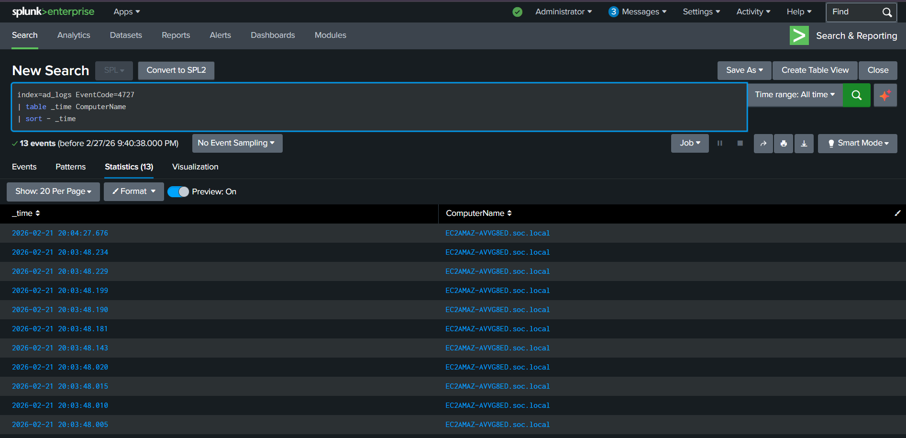

# AD-03 — Backdoor User & Group Creation Detection (Event ID 4720, 4727, 4728)


---

## 📋 Executive Summary

An attacker persistence and privilege escalation scenario was simulated inside an Active Directory domain environment. Using PowerShell with Administrator privileges on the Domain Controller, a backdoor user account (`hacker`) was created, a new security group (`IT-Support`) was provisioned, and the backdoor user was added to the group — mirroring real-world post-compromise persistence techniques. These three actions generated Event ID 4720 (User Account Created), Event ID 4727 (Security Group Created), and Event ID 4728 (Member Added to Group) in Windows Security logs. Splunk SIEM successfully detected all three events, enabling full reconstruction of the attacker's account manipulation chain. This lab demonstrates end-to-end detection capability for persistence and privilege escalation techniques in a domain environment.

---

## 🧩 Lab Environment

| Component | Details |
|---|---|
| Attacker Position | Logged in as Administrator on Domain Controller |
| Target Server | Active Directory Domain Controller (AWS EC2) |
| Method | PowerShell (New-ADUser, New-ADGroup, Add-ADGroupMember) |
| SIEM | Splunk (index = windows) |
| Log Source | Windows Security Event Log |
| Domain | soc.local |

---

## 🎯 Objectives

- Simulate an attacker creating a backdoor user account in Active Directory
- Simulate security group creation and user-to-group membership assignment
- Generate and capture Event ID 4720, 4727, and 4728 in Windows Security logs
- Detect all three events independently using Splunk SPL queries
- Correlate the full account manipulation chain in a single investigation workflow
- Map attacker actions to MITRE ATT&CK techniques

---

## 🔴 Attack Simulation

### Phase 1 — Create Backdoor User Account (Event ID 4720)

With Administrator access on the Domain Controller, PowerShell was used to create a new user account — simulating an attacker establishing a persistent backdoor identity in the domain.

```powershell
$pass = Read-Host "Enter Password" -AsSecureString

New-ADUser -Name "hacker" `
           -SamAccountName "hacker" `
           -UserPrincipalName "hacker@soc.local" `
           -Path "CN=Users,DC=soc,DC=local" `
           -AccountPassword $pass `
           -Enabled $true
```

Account creation was verified immediately:

```powershell
Get-ADUser -Identity hacker
```

Each successful user creation generates the following in Windows Security logs:

```
Event ID  : 4720
Log Source: Security
Category  : Account Management
Message   : A user account was created
```

**Screenshot — Backdoor User Creation & Verification (PowerShell):**

<p align="center">
  
</p>

---

### Phase 2 — Create Security Group (Event ID 4727)

A new domain security group was created — simulating an attacker provisioning a custom group to assign privileges without drawing attention to existing privileged groups.

```powershell
New-ADGroup -Name "IT-Support" `
            -SamAccountName "IT-Support" `
            -GroupScope Global `
            -GroupCategory Security `
            -Path "CN=Users,DC=soc,DC=local"
```

Group creation was verified:

```powershell
Get-ADGroup "IT-Support"
```

This generates the following event:

```
Event ID  : 4727
Log Source: Security
Category  : Account Management
Message   : A security-enabled global group was created
```

**Screenshot — Security Group Creation & Verification (PowerShell):**

<p align="center">
  
</p>

---

### Phase 3 — Add Backdoor User to Group (Event ID 4728)

The backdoor user was added to the newly created group — completing the privilege assignment step of the persistence chain.

```powershell
Add-ADGroupMember -Identity "IT-Support" -Members "hacker"
```

This generates the following event:

```
Event ID  : 4728
Log Source: Security
Category  : Account Management
Message   : A member was added to a security-enabled global group
```

**Screenshot — User Added to Group (PowerShell + Splunk Detection):**

<p align="center">
  
</p>

---

## 🔍 Indicators of Compromise (IOCs)

| Type | Value | Context |
|---|---|---|
| Backdoor Account | hacker | New user created by attacker |
| UPN | hacker@soc.local | Domain user principal name |
| Security Group | IT-Support | Attacker-created group for privilege assignment |
| Creator Account | Administrator | Compromised privileged account used |
| Domain Controller | soc.local DC | Target of account manipulation |
| Event ID | 4720 | User account creation — backdoor established |
| Event ID | 4727 | Security group creation — privilege container staged |
| Event ID | 4728 | Member added to group — privilege assigned |

---

## 📊 Splunk Detection

### Query 1 — Detect User Account Creation (Event ID 4720)

```spl
index=windows EventCode=4720
| table _time SubjectUserName TargetUserName ComputerName
| sort - _time
```

**What this reveals:**
- Which account was created (backdoor username)
- Who created it (SubjectUserName — the actor)
- When it was created and on which DC

**Screenshot — Splunk Detection (Event ID 4720):**

<p align="center">
  
</p>

---

### Query 2 — Detect Security Group Creation (Event ID 4727)

```spl
index=windows EventCode=4727
| table _time SubjectUserName TargetUserName ComputerName
| sort - _time
```

**What this reveals:**
- Name of the newly created security group
- Which account created the group
- Timestamp and originating domain controller

**Screenshot — Splunk Detection (Event ID 4727):**

<p align="center">
  
</p>

---

### Query 3 — Detect Member Added to Group (Event ID 4728)

```spl
index=windows EventCode=4728
| table _time SubjectUserName TargetUserName MemberName ComputerName
| sort - _time
```

**What this reveals:**
- Which user was added to which group
- Who performed the action
- Confirms privilege assignment step of the persistence chain

**Screenshot — Splunk Detection (Event ID 4728):**

<p align="center">
  
</p>

---

### Query 4 — Full Account Manipulation Chain (Correlation)

```spl
index=windows (EventCode=4720 OR EventCode=4727 OR EventCode=4728)
| table _time EventCode SubjectUserName TargetUserName ComputerName
| sort _time
```

**What this reveals:**
- Complete chronological sequence of the backdoor creation chain
- All three events correlated by the same actor (SubjectUserName)
- Enables reconstruction of the full attacker workflow in a single view

---

## 🚨 Detection Alert Rules

**Alert 1 — Backdoor Account Created**  
**Trigger:** EventCode=4720 outside approved provisioning windows or from unexpected accounts  
**Severity:** High

```spl
index=windows EventCode=4720
| stats count by SubjectUserName, TargetUserName, ComputerName
| where SubjectUserName!="svc-provisioning"
```

---

**Alert 2 — Unauthorized Security Group Created**  
**Trigger:** EventCode=4727 from non-IT admin accounts  
**Severity:** High

```spl
index=windows EventCode=4727
| stats count by SubjectUserName, TargetUserName, ComputerName
| sort - count
```

---

**Alert 3 — User Added to Sensitive Group**  
**Trigger:** EventCode=4728 for high-privilege groups (Domain Admins, Administrators)  
**Severity:** Critical

```spl
index=windows EventCode=4728
| search TargetUserName="Domain Admins" OR TargetUserName="Administrators"
| table _time SubjectUserName MemberName TargetUserName ComputerName
```

---

## 🕒 Attack Timeline

| Time | Event | Event ID | Notes |
|---|---|---|---|
| T+00:00 | Administrator access established | — | Attacker has privileged domain access |
| T+00:10 | Backdoor user `hacker` created | 4720 | New account provisioned via PowerShell |
| T+00:20 | Security group `IT-Support` created | 4727 | Privilege container staged |
| T+00:30 | `hacker` added to `IT-Support` | 4728 | Privilege assigned — persistence complete |
| T+00:35 | Splunk detects all three events | — | Detection chain fires across all queries |

---

## 🗺️ MITRE ATT&CK Mapping

| Tactic | Technique | ID | Observation |
|---|---|---|---|
| Persistence | Create Account — Domain Account | T1136.002 | Backdoor user `hacker` created in domain |
| Privilege Escalation | Account Manipulation | T1098 | User added to security group for elevated access |
| Privilege Escalation | Valid Accounts | T1078.002 | Leveraging Administrator account to provision access |
| Defense Evasion | Account Manipulation | T1098 | Creating new group instead of using visible privileged groups |

---

## ⚠️ Risk Assessment

| Factor | Value |
|---|---|
| Attack Type | Persistence & Privilege Escalation |
| Method | PowerShell AD cmdlets (native tooling — low noise) |
| Detection Events | 4720, 4727, 4728 |
| Severity | **High** |
| Impact | Persistent domain access via backdoor account |
| Lateral Movement Risk | High — domain user with group membership can access resources |
| Data Exposure Risk | High — depends on group privileges assigned |
| Stealth Level | Medium — uses legitimate admin tools (Living off the Land) |

**Why this is critical:**
- Attackers use built-in PowerShell AD cmdlets — no malware, no external tools
- Backdoor accounts survive password resets on other accounts
- New groups are less monitored than changes to existing privileged groups (Domain Admins)
- If `IT-Support` is later granted elevated permissions, the backdoor escalates silently

---

## 🛡️ SOC Analyst Investigation Checklist

When Event ID 4720, 4727, or 4728 is detected, a SOC analyst should:

- [ ] Identify who created the account/group — was it an authorized IT admin?
- [ ] Check if creation occurred during business hours or a known provisioning window
- [ ] Verify whether the new account appears in the HR/IT provisioning ticket system
- [ ] Inspect the account name — generic or suspicious names (e.g. `svc_`, `admin2`, `hacker`)
- [ ] Check what group the user was added to — is it a privileged group?
- [ ] Correlate 4720 → 4727 → 4728 from the same SubjectUserName within a short window
- [ ] Query for any logon events (4624) from the new account after creation
- [ ] Check if the new account has been used for lateral movement (Event ID 4648, 4672)
- [ ] Disable and isolate the suspicious account immediately if unauthorized
- [ ] Remove the account from any groups it was assigned to
- [ ] Escalate to Tier 2 if privileged group membership or domain admin involvement confirmed

---

## 🔧 Recommended Defensive Actions

| Action | Priority |
|---|---|
| Deploy Splunk alerts for EventCode 4720, 4727, 4728 | 🔴 Immediate |
| Alert on any addition to Domain Admins / Administrators group | 🔴 Immediate |
| Restrict AD user/group creation to dedicated service accounts only | 🟠 High |
| Implement Just-In-Time (JIT) privileged access for admin tasks | 🟠 High |
| Enable PowerShell Script Block Logging to capture cmdlet usage | 🟠 High |
| Regular audit of AD users and groups for unauthorized accounts | 🟡 Medium |
| Integrate AD provisioning with ticketing system for baseline comparison | 🟡 Medium |
| Deploy honeypot AD accounts to detect enumeration | 🟡 Medium |

---

## 🧹 Lab Cleanup

After completing the simulation, remove the test objects:

```powershell
# Remove backdoor user
Remove-ADUser -Identity "hacker" -Confirm:$false

# Remove security group
Remove-ADGroup -Identity "IT-Support" -Confirm:$false
```

Verify removal:

```powershell
Get-ADUser -Identity hacker    # Should return error — user not found
Get-ADGroup -Identity IT-Support  # Should return error — group not found
```

---

## 🧾 Investigation Summary

An attacker persistence chain was simulated on the Active Directory Domain Controller using native PowerShell AD cmdlets under a compromised Administrator account. Three sequential actions were performed: creation of a backdoor user account (`hacker`), creation of a new security group (`IT-Support`), and assignment of the backdoor user to that group — generating Event ID 4720, 4727, and 4728 respectively in Windows Security logs.

Splunk SIEM detected all three events independently via targeted SPL queries and confirmed the attacker's identity (SubjectUserName), the affected objects, and the full timeline of the manipulation chain. Correlation of all three events within a short timeframe from the same actor provides high-confidence detection of the persistence and privilege escalation pattern.

This simulation demonstrates that Living-off-the-Land techniques using native AD tooling generate clear, detectable audit events — validating the importance of monitoring Account Management event categories in any enterprise SOC.

**Lab Status:** ✅ User Created → ✅ Group Created → ✅ Member Added → ✅ All Events Detected in Splunk → ✅ Full Chain Investigated

---

## 🔗 Related Labs

- [AD-01 — Brute Force RDP Detection (Event ID 4625)](../AD-01_Brute_Force_RDP_4625.md)
- [AD-02 — Account Lockout Detection (Event ID 4740)](../AD-02_Account_Lockout_4740.md)
- [E4 — Local Privilege Escalation via Administrators Group](../../endpoint-attacks/E4_Privilege_Escalation_4732.md)

---

*Lab environment: Active Directory on AWS EC2 Windows Server | Splunk Free | Author: [Nadil](https://github.com/Nadhil-an)*
